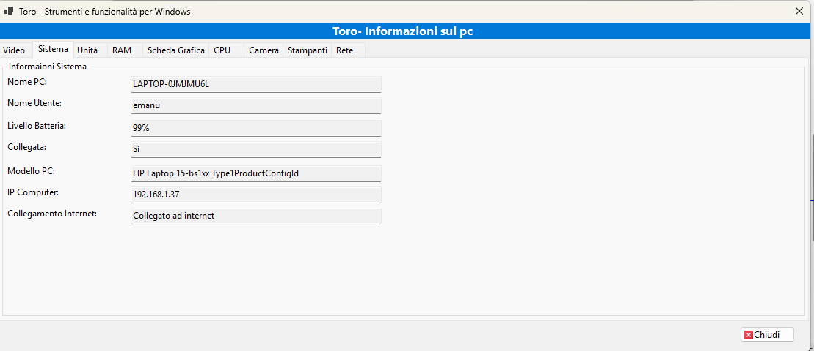

# Toro

Toro — programma gratuito per gestire le informazioni del sistema operativo Windows e utilità correlate.
Toro is a lightweight, free application that summarizes Windows hardware and software information and provides useful utilities.

## Descrizione / Description

ITA
Toro è un'applicazione leggera e gratuita che riepiloga le informazioni hardware e software di Windows e offre strumenti utili per diagnostica e manutenzione.

ENG
Toro is a lightweight, free application that summarizes Windows hardware and software information and offers useful diagnostic and maintenance tools.

## Caratteristiche principali / Key features
- Visualizzazione dettagliata delle informazioni hardware (CPU, memoria, disco, GPU).
- Riepilogo software e servizi in esecuzione.
- Strumenti di diagnostica rete (IP, DNS, test ping).
- Utility per aprire cartelle di sistema, copiare informazioni negli appunti e generare report.
- Interfaccia semplice e localizzata in italiano.

## Screenshot

  

  

## Requisiti / Requirements

ITA
- Windows 10/11
- .NET (specifica la versione: .NET Framework o .NET 5/6/7) — specifica qui la versione usata dal progetto.

ENG
- Windows 10/11
- .NET runtime (specify whether .NET Framework or .NET 5/6/7 and the exact version required).

## Installazione / Installation

ITA
1. Scarica l'installer o il pacchetto ZIP dalla pagina delle release.
2. Esegui l'installer o estrai lo ZIP.
3. Avvia Toro dal menu Start.

ENG
1. Download the installer or ZIP package from the Releases page.
2. Run the installer or extract the ZIP.
3. Launch Toro from the Start menu.

## Uso / Usage

ITA
- Avvia l'app e naviga tra le schede per visualizzare Hardware, Software, Rete, Utility.
- Per esportare un report: clicca su "Esporta" e scegli il formato (TXT/JSON).

ENG
- Launch the app and navigate the tabs to view Hardware, Software, Network, Utilities.
- To export a report: click "Export" and choose the format (TXT/JSON).

## Come aggiungere screenshot (consigli) / How to add screenshots (tips)
- Crea la cartella `assets/screenshots/`.
- Usa PNG per UI e testo, JPEG se vuoi ridurre la dimensione.
- Dimensione consigliata: larghezza 800–1200 px.
- Ottimizza le immagini per ridurre il peso.

## Licenza / License
Il repository include già una licenza GPL-3.0.

## Contribuire / Contributing
- Fork del repository.
- Nuova branch per le modifiche: `feature/nome-funzione`.
- Pull request con descrizione delle modifiche.

## Contatti / Contact
Autore: Emanuele
Repo: https://github.com/Emanuele2025/Toro
